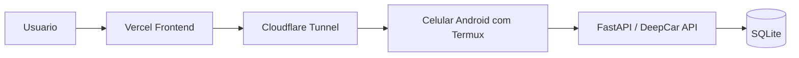

# DeepCar no celular como VPS

Este guia descreve como usar um celular Android antigo como um "mini VPS" para o backend do DeepCar, mantendo:

- frontend no Vercel
- backend FastAPI no celular
- banco SQLite no proprio celular
- acesso externo por tunel HTTPS

O foco aqui e estabilidade 24h por dia com baixo custo. O guia assume que o celular vai ficar sempre ligado na tomada e conectado ao Wi-Fi.

## Visao geral da arquitetura



## Realidade do DeepCar no celular

O que funciona bem nesse modelo:

- servir a API FastAPI
- manter SQLite local
- responder `/health`, `/docs`, `/api/search`, `/api/car/{id}` e afins
- ficar sempre acessivel por um tunel HTTPS

O que fica fraco nesse modelo:

- scraping continuo por horas em aparelho fraco
- jobs pesados e continuos rodando 24h
- bootstrap automatico agressivo do backend

Para o DeepCar atual, o melhor uso do celular e este:

1. celular = API + SQLite + proxy de imagens
2. Vercel = frontend
3. scraping pesado = fora do celular quando necessario

Se voce tentar usar o celular para o pacote completo do DeepCar, incluindo scraping constante e bootstrap agressivo, a chance de instabilidade sobe bastante.

## Requisitos minimos

- celular Android antigo, mas com pelo menos 4 GB de RAM se possivel
- carregador confiavel
- Wi-Fi estavel
- pelo menos 10 GB livres
- conta no GitHub
- conta no Vercel
- conta na Cloudflare
- idealmente um dominio configurado na Cloudflare para ter URL fixa

## Preparacao fisica do celular

Antes de instalar qualquer coisa:

1. retire capa grossa se o aparelho esquentar muito
2. deixe o aparelho em local ventilado
3. se nao for usar chip, ative modo aviao e religue apenas o Wi-Fi
4. ative a opcao de desenvolvedor `Stay awake while charging`, se existir no aparelho
5. desative otimizacao de bateria para Termux e Termux:Boot
6. configure o Android para manter o Wi-Fi ligado durante repouso
7. desative atualizacoes automaticas que possam reiniciar o aparelho em horario ruim

## Aplicativos recomendados

Instale pelo F-Droid, nao pela Play Store:

- Termux
- Termux:Boot

Opcional:

- Termux:API

## Passo 1: instalar dependencias no Termux

Abra o Termux e rode:

```bash
pkg update -y
pkg upgrade -y
pkg install -y curl git python nano tmux openssh sqlite clang rust make pkg-config libffi openssl libjpeg-turbo libxml2 libxslt termux-services cloudflared
```

Observacao:

- alguns pacotes Python do DeepCar compilam extensoes nativas, por isso os pacotes de build acima
- `cloudflared` e usado para expor a API sem abrir porta no roteador

## Passo 2: clonar o projeto

Escolha uma pasta de trabalho e clone o repositorio:

```bash
cd ~
git clone https://github.com/MatheusRocha-X/DeepCar.git deepcar
cd ~/deepcar
```

## Passo 3: criar ambiente virtual do backend

```bash
cd ~/deepcar
python -m venv .venv
source .venv/bin/activate
pip install --upgrade pip setuptools wheel
pip install -r backend/requirements.phone.txt
```

Observacao importante:

- use `backend/requirements.phone.txt` no celular; a OLX agora roda sem Playwright nesse modo
- mantenha o pacote `curl` instalado no Termux porque a OLX pode bloquear `httpx` com 403 e o scraper faz fallback automatico para o `curl` do sistema

Se a instalacao falhar em alguma dependencia nativa, rode novamente depois de confirmar que os pacotes do Passo 1 foram instalados corretamente.

## Passo 4: configurar o backend

Crie o arquivo de ambiente:

```bash
cd ~/deepcar/backend
cp .env.example .env
nano .env
```

Use algo nesta linha:

```env
DATABASE_URL=sqlite+aiosqlite:///./deepcar.db
SECRET_KEY=troque-por-uma-chave-forte
DEBUG=false
ENABLE_SCRAPER=true
ENABLE_SCHEDULER=true
ENABLE_STARTUP_BOOTSTRAP=true
SCRAPER_INTERVAL_MINUTES=60
MAX_PAGES_PER_SOURCE=5
CORS_ORIGINS=["http://localhost:3000","http://127.0.0.1:3000","https://SEU-PROJETO.vercel.app"]
```

Notas importantes:

- o SQLite vai ficar em `~/deepcar/backend/deepcar.db`
- o cache atual do projeto e em memoria, entao Redis nao e obrigatorio
- ajuste `CORS_ORIGINS` com a URL real do seu frontend no Vercel
- se o aparelho esquentar demais, primeiro reduza `SCRAPER_INTERVAL_MINUTES` ou volte apenas `ENABLE_STARTUP_BOOTSTRAP=false`

## Passo 5: testar a API localmente no celular

```bash
cd ~/deepcar/backend
source ~/deepcar/.venv/bin/activate
uvicorn app.main:app --host 127.0.0.1 --port 8000 --workers 1
```

Em outro terminal do Termux, teste:

```bash
curl http://127.0.0.1:8000/health
```

Voce deve receber:

```json
{"status":"healthy"}
```

Se quiser interromper, use `Ctrl+C`.

## Passo 6: criar URL publica para o backend

### Opcao de teste rapido

Para testar sem dominio proprio:

```bash
cloudflared tunnel --url http://127.0.0.1:8000
```

Isso gera uma URL temporaria em `trycloudflare.com`. E bom para teste, mas nao para producao, porque muda quando voce reinicia o tunel.

### Opcao recomendada para 24h por dia

Use um dominio seu na Cloudflare.

1. adicione seu dominio na Cloudflare
2. autentique o `cloudflared`:

```bash
cloudflared tunnel login
```

3. crie o tunel:

```bash
cloudflared tunnel create deepcar-phone
```

4. crie o DNS do backend:

```bash
cloudflared tunnel route dns deepcar-phone api.seudominio.com
```

5. crie o arquivo `~/.cloudflared/config.yml`:

```yaml
tunnel: deepcar-phone
credentials-file: /data/data/com.termux/files/home/.cloudflared/SEU-TUNNEL-ID.json

ingress:
  - hostname: api.seudominio.com
    service: http://127.0.0.1:8000
  - service: http_status:404
```

6. teste o tunel:

```bash
cloudflared tunnel --config ~/.cloudflared/config.yml run
```

7. com a API ligada, teste:

```bash
curl https://api.seudominio.com/health
```

## Passo 7: deixar o backend ligado 24h por dia

### 7.1 Ativar wake lock do Termux

```bash
termux-wake-lock
```

Isso ajuda a evitar que o Android suspenda o processo.

### 7.2 Criar servico do backend

```bash
mkdir -p ~/.termux/service/deepcar-api
nano ~/.termux/service/deepcar-api/run
```

Conteudo sugerido:

```sh
#!/data/data/com.termux/files/usr/bin/sh
exec 2>&1
cd /data/data/com.termux/files/home/deepcar/backend || exit 1
. /data/data/com.termux/files/home/deepcar/.venv/bin/activate
exec uvicorn app.main:app --host 127.0.0.1 --port 8000 --workers 1
```

Depois:

```bash
chmod +x ~/.termux/service/deepcar-api/run
```

### 7.3 Criar servico do tunel

```bash
mkdir -p ~/.termux/service/cloudflared
nano ~/.termux/service/cloudflared/run
```

Conteudo sugerido:

```sh
#!/data/data/com.termux/files/usr/bin/sh
exec 2>&1
exec cloudflared tunnel --config /data/data/com.termux/files/home/.cloudflared/config.yml run
```

Depois:

```bash
chmod +x ~/.termux/service/cloudflared/run
```

### 7.4 Subir os servicos

Abra uma nova sessao do Termux ou rode:

```bash
source $PREFIX/etc/profile.d/start-services.sh
sv-enable deepcar-api
sv-enable cloudflared
sv up deepcar-api
sv up cloudflared
```

Para conferir:

```bash
sv status deepcar-api
sv status cloudflared
```

## Passo 8: iniciar automaticamente depois de reboot

Crie a pasta de boot:

```bash
mkdir -p ~/.termux/boot
nano ~/.termux/boot/start-deepcar.sh
```

Conteudo sugerido:

```sh
#!/data/data/com.termux/files/usr/bin/sh
termux-wake-lock
source /data/data/com.termux/files/usr/etc/profile
source /data/data/com.termux/files/usr/etc/profile.d/start-services.sh
sv up deepcar-api
sv up cloudflared
```

Depois:

```bash
chmod +x ~/.termux/boot/start-deepcar.sh
```

Agora, quando o celular reiniciar, o Termux:Boot deve levantar os servicos automaticamente.

## Passo 9: apontar o frontend do Vercel para o celular

No Vercel, configure:

```env
NEXT_PUBLIC_API_URL=https://api.seudominio.com/api
```

Depois faca um redeploy do frontend.

## Passo 10: rotina de atualizacao

Quando voce fizer alteracoes no GitHub:

```bash
cd ~/deepcar
git pull origin main
source .venv/bin/activate
pip install -r backend/requirements.phone.txt
sv restart deepcar-api
```

## Passo 11: backup do SQLite

Crie uma pasta de backup:

```bash
mkdir -p ~/backups
```

Backup manual:

```bash
sqlite3 ~/deepcar/backend/deepcar.db ".backup ~/backups/deepcar-$(date +%F).db"
```

Se quiser mais seguranca, copie periodicamente a pasta `~/backups` para outro equipamento.

## Passo 12: limites e riscos reais

### 1. Carga de scraping no Android

O maior ponto de risco do DeepCar no celular continua sendo o scraping frequente. A OLX agora pode rodar sem Playwright, com leitura de `__NEXT_DATA__` e fallback para `curl`, mas em um Android antigo isso ainda pode:

- esquentar demais o aparelho
- ser morto pelo sistema
- sofrer bloqueios temporarios do site
- deixar o app instavel ao longo dos dias

### 2. Scheduler embutido no FastAPI

Hoje o backend sobe com APScheduler dentro de `app.main`. Isso significa que, quando a API sobe, ela tambem tenta iniciar:

- scrape geral
- refresh de anuncios
- limpeza
- atualizacao FIPE
- reprocessamento de score

Para o uso em celular, isso pode ser pesado demais dependendo do aparelho, principalmente quando bootstrap e scheduler rodam juntos.

### 3. SQLite em celular

SQLite funciona bem para pouco volume e um unico processo, mas:

- armazenamento de celular e mais lento que SSD de servidor
- o banco pode crescer com tempo e fotos/proxy/cache de uso
- desligamentos bruscos nao sao bons para integridade do arquivo

## Recomendacao tecnica para o DeepCar nesse cenario

Se voce quer usar o celular como backend 24h por dia, a configuracao mais segura continua sendo controlar a agressividade do scraping:

1. celular roda API + SQLite + scheduler
2. frontend fica no Vercel
3. bootstrap inicial e intervalo de scraping devem ser ajustados conforme temperatura e estabilidade do aparelho

Se o celular nao aguentar scraping continuo, o melhor plano B continua sendo mover apenas a coleta para:

- seu PC
- GitHub Actions
- uma VM gratuita separada

## Checklist final

Antes de considerar o setup pronto, confirme:

- `curl http://127.0.0.1:8000/health` responde no Termux
- `curl https://api.seudominio.com/health` responde fora do Termux
- `NEXT_PUBLIC_API_URL` no Vercel aponta para `.../api`
- Termux esta fora da otimizacao de bateria
- Termux:Boot esta instalado
- `sv status deepcar-api` mostra o backend ativo
- `sv status cloudflared` mostra o tunel ativo
- o celular fica frio o bastante para operar continuamente

## Quando esse modelo faz sentido

Use esse modelo se voce quer:

- gastar o minimo possivel
- aprender infraestrutura pratica
- manter uma API leve no ar sem pagar mensalidade alta

Nao use esse modelo como principal se voce precisa de:

- scraping continuo pesado
- alta disponibilidade real
- tolerancia baixa a queda
- manutencao zero